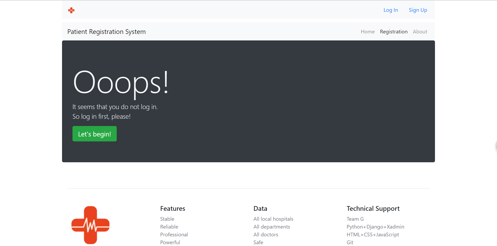
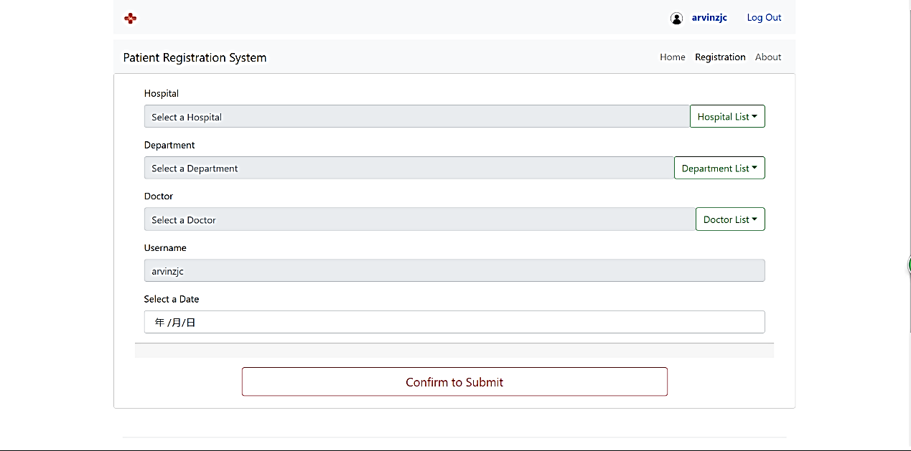
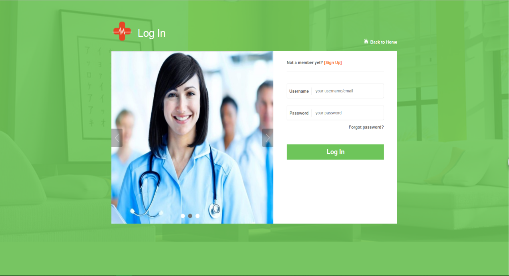
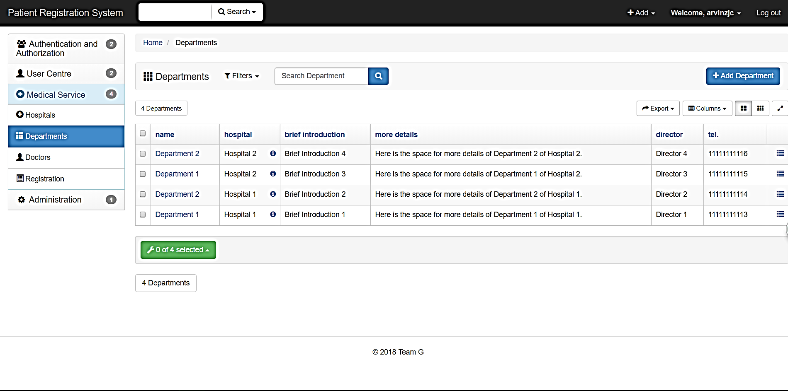
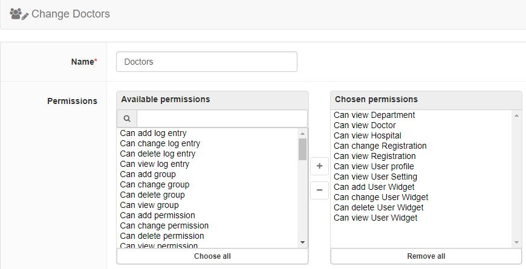
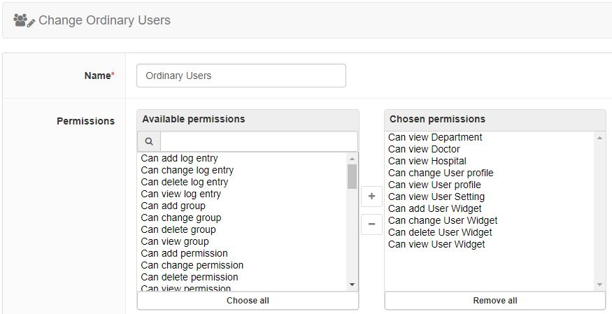

# TeamG_PatientRegistrationSystem From the Project BUAAHND_G3T1_TWC

This project is named as Patient Registration System which contains a simplified patient registration system based on Web developed by **Team G** as the final assignment of the course **Team Working in Computing**  during Term 1 of Grade 3 in BUAA HND. It must be admitted that although all team members worked hard on developing a system close to these commercial ones, we still have a long way to go.

## About Team G

Team members are **Liu Haodong** (Team Leader), **Zhao Jichen**, **Ye Yifan**, and **Wang Annong**.

## Partial UI

Figure 1

Figure 2

Figure 3

Figure 4

Figure 5

## ATTENTION

1. By 13 November 2018, the official version of Xadmin had not worked well with Django 2.1, so do not type the command "pip install xadmin" into the command prompt under the root directory of the system! If it has been installed, please uninstall it! The system will use Xadmin modified from an official version by the third party. Thanks to vip68 (<https://github.com/vip68/xadmin_bugfix>)!
2. You can type the command "pip install -r requirements.txt" into the command prompt under the root directory of the project to simplify the pip installation.
3. Some common commands for running this system are listed as follows:
   * python manage.py makemigrations --empty users
   * python manage.py makemigrations --empty hospitals
   * python manage.py makemigrations
   * python manage.py migrate users
   * python manage.py migrate
   * python manage.py createsuperuser
   * python manage.py runserver
4. For the current version of the data file (db.sqlite3), it contains doctor accounts for test purposes which cannot log in (Doctor1, Doctor2, Doctor3, Doctor4, Doctor5, Doctor6, and Doctor7), and it also has the following real accounts (username/email, password):
   * vikashd/vikas@igres.net, vikas123
   * arvinzjc/tomzjc@qq.com, adminzjc
   * soap/sardinecountry@163.com, adminyyf
   * arnold/864179009@qq.com, adminwan
   * Doctor8/192182785@qq.com, 123456
5. Figure 6 shows the suggested settings for the user group Doctors, while Figure 7 indicates the suggested settings for the user group Ordinary Users.

Figure 6

Figure 7

For more info on the project, turn to the relevant reports.